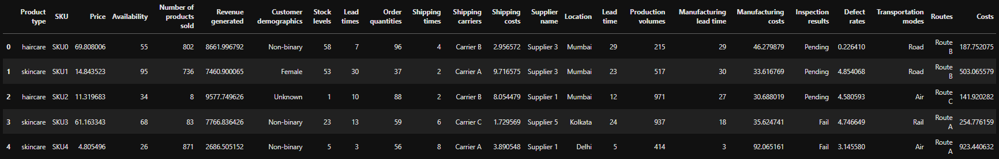
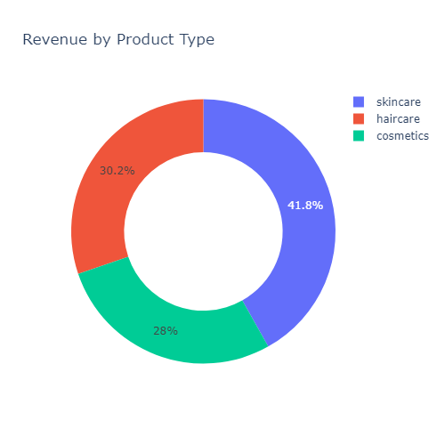
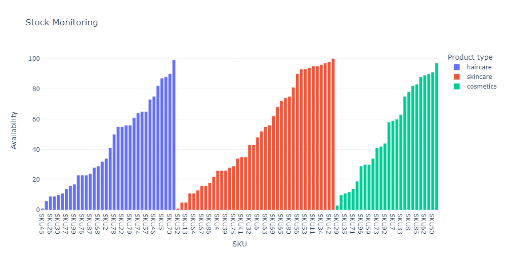
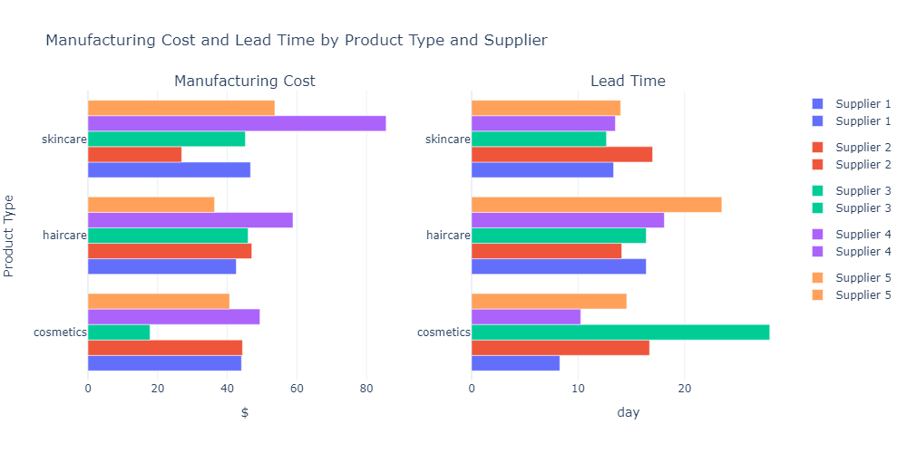

# Supply Chain Analytics for Beauty Retailers
---
## Background

Sephora, an iconic beauty retailer, has established itself as a trailblazer in the industry. With a history dating back to 1970s France, Sephora has grown into a global beauty powerhouse, redefining the retail experience and shaping the beauty landscape. A key element of their success lies in their innovative approach to supply chain and data analytics, which empowers them to stay ahead in a constantly evolving and highly competitive market.

Sephora's supply chain management stands as a testament to its commitment to excellence. The company maintains a sophisticated network of suppliers and distribution channels, ensuring the timely and efficient delivery of products to their stores worldwide. Beyond just logistics, Sephora employs advanced data analytics to predict consumer trends, enabling them to stock their shelves with the most sought-after beauty products. This data-driven approach minimizes inventory inefficiencies, reduces waste, and maximizes profits. By harnessing the power of data analytics, Sephora delivers a personalized shopping experience to each customer, understanding their preferences and offering tailored product recommendations, enhancing customer loyalty and revenue streams.

---
## Using Supply Chain Data to Draw Business Insights

a typical supply chain involves sourcing, manufacturing, distribution, inventory management, consumers. This analysis uses data from [Statsio](https://statso.io/supply-chain-analysis-case-study/) that contains product data as listed below:

No|Feature
---|---
1|Product Type
2|SKU (Stock Keeping Unit)
3|Price
4|Availability
5|Number of products sold
6|Revenue generated
7|Customer demographics
8|Stock levels
9|Lead times
10|Order quantities
11|Shipping times
12|Shipping carriers
13|Shipping costs
14|Supplier name
15|Location
16|Lead time
17|Production volumes
18|Manufacturing lead time
19|Manufacturing costs
20|Inspection results
21|Defect rates
22|Transportation modes
23|Routes
24|Costs

---
## Answering Business Questions
1. Which product generates the highest revenue?
> By aggregating different SKUs based on their product types, we can see how much each product contributes to the total revenue.  
> There are 3 different product types: `skincare`, `haircare`, `cosmetics`. Skincare contributed the highest proportion (42%) to the business revenue.

2. Which products are low in stocks?
> Firstly, we need to sort SKUs based on their availability to help us visualize which products are low in stock. Then, we group each SKUs based on their product types.  
> In general, there is no one product type that is low on stocks, all of them have a similar distribution.

3. Which suppliers have the highest manufacturing cost?
> Supplier 4 has a relatively high manufacturing cost for skincare, with no faster lead time compared to other suppliers. We can consider negotiating a better deal with this supplier.  
> When demand is not high, we can consider saving cost with the expense of longer lead time by diverting manufacture of cosmetics to supplier 3 and skincare to supplier 2.

---
## Conclusion
Data analytics plays a crucial role in supply chain management by providing insights and actionable information to optimize various aspects of the supply chain. In the previous section, only a few examples involving customer insights, inventory management, and cost reduction are illustrated. There are more analysis that we can leverage on to drive business decision in the ever more complex supply chain architecture.

---
## Code
The full version code notebook with interactive version of above plots can be found in [this link](https://nbviewer.org/github/darwisjap/beauty_retailer_supply_chain_analytics/blob/main/code/notebook.ipynb).
